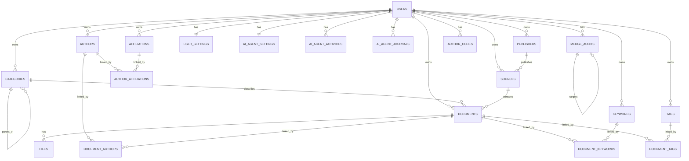

# 数据库实体、属性与关系说明

本文档基于当前项目的 SQLAlchemy 模型定义整理，来源文件为 `app/models.py`。用于说明数据库中各表的实体含义、主要属性、约束和表间关系。

## 1. 总体说明

- 当前数据库以 `users` 为数据归属核心，大部分业务表都通过 `user_id` 关联到用户，实现按用户隔离数据。
- 业务核心围绕 `documents` 展开，分类、来源、作者、关键词、标签、附件都服务于文献管理。
- 数据库同时包含 AI 助手相关配置、行为日志、周期总结，以及合并审计记录等辅助功能表。

## 2. 实体关系总览

## 3. 核心业务实体

### 3.1 `users` 用户表

**实体含义**

系统用户，包括普通用户、管理员和注册审核人员。

**主要属性**

| 字段 | 类型 | 说明 |
| --- | --- | --- |
| `id` | Integer, PK | 用户主键 |
| `username` | String(64) | 用户名，唯一，必填，建索引 |
| `password_hash` | String(255) | 密码哈希，必填 |
| `email` | String(128) | 邮箱，唯一 |
| `is_admin` | Boolean | 是否管理员 |
| `can_review_registrations` | Boolean | 是否可审核注册 |
| `is_approved` | Boolean | 是否通过审批 |
| `approval_status` | Enum | 审批状态：`pending`、`approved`、`rejected` |
| `created_at` | DateTime | 创建时间 |

**关系**

- 1 对多：`users -> categories`
- 1 对多：`users -> documents`
- 1 对多：`users -> publishers`
- 1 对多：`users -> sources`
- 1 对多：`users -> affiliations`
- 1 对多：`users -> authors`
- 1 对多：`users -> keywords`
- 1 对多：`users -> tags`
- 1 对多：`users -> ai_agent_activities`
- 1 对多：`users -> ai_agent_journals`
- 1 对多：`users -> merge_audits`
- 1 对多：`users -> author_codes`
- 1 对 1：`users -> user_settings`
- 1 对 1：`users -> ai_agent_settings`

### 3.2 `categories` 分类表

**实体含义**

用于管理文献分类，支持父子层级分类。

**主要属性**

| 字段 | 类型 | 说明 |
| --- | --- | --- |
| `id` | Integer, PK | 分类主键 |
| `user_id` | Integer, FK | 所属用户，关联 `users.id` |
| `parent_id` | Integer, FK, Nullable | 父分类，关联 `categories.id` |
| `name` | String(128) | 分类名称，必填 |
| `created_at` | DateTime | 创建时间 |

**关系**

- 多对 1：`categories -> users`
- 自关联 1 对多：一个分类可包含多个子分类
- 1 对多：`categories -> documents`

### 3.3 `publishers` 出版社表

**实体含义**

记录文献来源的出版社信息。

**主要属性**

| 字段 | 类型 | 说明 |
| --- | --- | --- |
| `id` | Integer, PK | 出版社主键 |
| `user_id` | Integer, FK | 所属用户 |
| `name` | String(256) | 出版社名称，必填 |
| `address` | String(256) | 地址 |
| `website` | String(256) | 官网 |

**约束**

- 唯一约束：`(user_id, name)`

**关系**

- 多对 1：`publishers -> users`
- 1 对多：`publishers -> sources`

### 3.4 `sources` 来源表

**实体含义**

表示文献发表或归属的来源，如期刊、会议、书系等。

**主要属性**

| 字段 | 类型 | 说明 |
| --- | --- | --- |
| `id` | Integer, PK | 来源主键 |
| `user_id` | Integer, FK | 所属用户 |
| `name` | String(256) | 来源名称，必填，建索引 |
| `type` | Enum | 来源类型：`journal`、`conference`、`book_series`、`other` |
| `publisher_id` | Integer, FK, Nullable | 出版社，关联 `publishers.id` |
| `issn` | String(20) | 刊号 |

**约束**

- 唯一约束：`(user_id, name, type)`

**关系**

- 多对 1：`sources -> users`
- 多对 1：`sources -> publishers`
- 1 对多：`sources -> documents`

### 3.5 `affiliations` 机构表

**实体含义**

记录作者所属机构或单位。

**主要属性**

| 字段 | 类型 | 说明 |
| --- | --- | --- |
| `id` | Integer, PK | 机构主键 |
| `user_id` | Integer, FK | 所属用户 |
| `name` | String(256) | 机构名称，必填 |
| `address` | String(256) | 地址 |

**约束**

- 唯一约束：`(user_id, name)`

**关系**

- 多对 1：`affiliations -> users`
- 多对多：`affiliations <-> authors`，通过 `author_affiliations`

### 3.6 `authors` 作者表

**实体含义**

记录文献作者。为解决同名作者区分问题，额外使用 `code` 作为区分编号。

**主要属性**

| 字段 | 类型 | 说明 |
| --- | --- | --- |
| `id` | Integer, PK | 作者主键 |
| `user_id` | Integer, FK | 所属用户 |
| `name` | String(128) | 作者姓名，必填，建索引 |
| `code` | SmallInteger | 同名作者区分码，默认 `1` |

**约束**

- 唯一约束：`(user_id, name, code)`

**关系**

- 多对 1：`authors -> users`
- 多对多：`authors <-> affiliations`，通过 `author_affiliations`
- 多对多：`authors <-> documents`，通过 `document_authors`

### 3.7 `author_codes` 作者编码表

**实体含义**

用于记录某个用户下某个作者姓名的下一个可用编号，辅助生成同名作者 `code`。

**主要属性**

| 字段 | 类型 | 说明 |
| --- | --- | --- |
| `user_id` | Integer, PK, FK | 所属用户 |
| `name` | String(128), PK | 作者姓名 |
| `next_code` | SmallInteger | 下一个可用编号，默认 `2` |

**关系**

- 多对 1：`author_codes -> users`

### 3.8 `keywords` 关键词表

**实体含义**

记录文献关键词。

**主要属性**

| 字段 | 类型 | 说明 |
| --- | --- | --- |
| `id` | Integer, PK | 关键词主键 |
| `user_id` | Integer, FK | 所属用户 |
| `name` | String(128) | 关键词名称，必填 |

**约束**

- 唯一约束：`(user_id, name)`

**关系**

- 多对 1：`keywords -> users`
- 多对多：`keywords <-> documents`，通过 `document_keywords`

### 3.9 `tags` 标签表

**实体含义**

记录用户自定义标签，用于更灵活地组织文献。

**主要属性**

| 字段 | 类型 | 说明 |
| --- | --- | --- |
| `id` | Integer, PK | 标签主键 |
| `user_id` | Integer, FK | 所属用户 |
| `name` | String(128) | 标签名称，必填 |

**约束**

- 唯一约束：`(user_id, name)`

**关系**

- 多对 1：`tags -> users`
- 多对多：`tags <-> documents`，通过 `document_tags`

### 3.10 `documents` 文献表

**实体含义**

系统的核心实体，保存文献信息和馆藏扩展信息。

**主要属性**

| 字段 | 类型 | 说明 |
| --- | --- | --- |
| `id` | Integer, PK | 文献主键 |
| `user_id` | Integer, FK | 所属用户 |
| `category_id` | Integer, FK, Nullable | 所属分类 |
| `source_id` | Integer, FK, Nullable | 所属来源 |
| `title` | String(512) | 标题，必填 |
| `abstract` | Text | 摘要 |
| `document_type` | Enum | 文献类型：`journal_article`、`conference_paper`、`book`、`thesis`、`report`、`other` |
| `publication_year` | SmallInteger | 出版年份 |
| `volume` | String(32) | 卷号 |
| `issue` | String(32) | 期号 |
| `pages` | String(32) | 页码 |
| `doi` | String(128) | DOI，建索引 |
| `notes` | Text | 备注 |
| `rating` | SmallInteger | 评分 |
| `reading_status` | Enum | 阅读状态：`unread`、`reading`、`read` |
| `barcode` | String(64), Nullable | 条码 |
| `copy_no` | String(64), Nullable | 馆藏编号或副本号 |
| `created_at` | DateTime | 创建时间 |
| `updated_at` | DateTime | 更新时间 |

**约束**

- 唯一约束：`(user_id, barcode)`
- 唯一约束：`(user_id, copy_no)`

**关系**

- 多对 1：`documents -> users`
- 多对 1：`documents -> categories`
- 多对 1：`documents -> sources`
- 多对多：`documents <-> authors`，通过 `document_authors`
- 多对多：`documents <-> keywords`，通过 `document_keywords`
- 多对多：`documents <-> tags`，通过 `document_tags`
- 1 对多：`documents -> files`

## 4. 关联表

### 4.1 `author_affiliations` 作者机构关联表

**实体含义**

实现作者与机构的多对多关系。

**主要属性**

| 字段 | 类型 | 说明 |
| --- | --- | --- |
| `author_id` | Integer, PK, FK | 作者 ID，关联 `authors.id` |
| `affiliation_id` | Integer, PK, FK | 机构 ID，关联 `affiliations.id` |

**关系**

- 多对 1：`author_affiliations -> authors`
- 多对 1：`author_affiliations -> affiliations`

### 4.2 `document_authors` 文献作者关联表

**实体含义**

实现文献与作者的多对多关系，并保存作者顺序。

**主要属性**

| 字段 | 类型 | 说明 |
| --- | --- | --- |
| `document_id` | Integer, PK, FK | 文献 ID，关联 `documents.id` |
| `author_id` | Integer, PK, FK | 作者 ID，关联 `authors.id` |
| `author_order` | SmallInteger | 作者排序，默认 `1` |

**关系**

- 多对 1：`document_authors -> documents`
- 多对 1：`document_authors -> authors`

### 4.3 `document_keywords` 文献关键词关联表

**实体含义**

实现文献与关键词的多对多关系。

**主要属性**

| 字段 | 类型 | 说明 |
| --- | --- | --- |
| `document_id` | Integer, PK, FK | 文献 ID |
| `keyword_id` | Integer, PK, FK | 关键词 ID |

**关系**

- 多对 1：`document_keywords -> documents`
- 多对 1：`document_keywords -> keywords`

### 4.4 `document_tags` 文献标签关联表

**实体含义**

实现文献与标签的多对多关系。

**主要属性**

| 字段 | 类型 | 说明 |
| --- | --- | --- |
| `document_id` | Integer, PK, FK | 文献 ID |
| `tag_id` | Integer, PK, FK | 标签 ID |

**关系**

- 多对 1：`document_tags -> documents`
- 多对 1：`document_tags -> tags`

## 5. 配置与辅助实体

### 5.1 `user_settings` 用户设置表

**实体含义**

记录用户级系统设置。

**主要属性**

| 字段 | 类型 | 说明 |
| --- | --- | --- |
| `user_id` | Integer, PK, FK | 用户 ID |
| `mineru_url` | String(256) | MinerU 服务地址 |

**关系**

- 1 对 1：`user_settings <-> users`

### 5.2 `ai_agent_settings` AI 助手设置表

**实体含义**

记录用户的 AI 助手开关、接口地址、模型和偏好设置。

**主要属性**

| 字段 | 类型 | 说明 |
| --- | --- | --- |
| `user_id` | Integer, PK, FK | 用户 ID |
| `agent_name` | String(64) | 助手名称，默认 `Eyjafjalla` |
| `enabled` | Boolean | 是否启用 |
| `api_url` | String(512) | AI 接口地址 |
| `api_key` | Text | API Key 密文存储 |
| `model` | String(64) | 模型名称 |
| `user_preference` | String(500) | 用户偏好 |
| `daily_rollup_minute` | Integer | 每日汇总时间，按分钟数存储 |
| `last_rollup_at` | DateTime, Nullable | 上次汇总时间 |
| `created_at` | DateTime | 创建时间 |
| `updated_at` | DateTime | 更新时间 |

**关系**

- 1 对 1：`ai_agent_settings <-> users`

### 5.3 `ai_agent_activities` AI 助手活动表

**实体含义**

记录 AI 助手的行为日志或事件轨迹。

**主要属性**

| 字段 | 类型 | 说明 |
| --- | --- | --- |
| `id` | Integer, PK | 活动主键 |
| `user_id` | Integer, FK | 用户 ID |
| `event_type` | String(64) | 事件类型，建索引 |
| `label` | String(256) | 事件标题或标签 |
| `metadata_json` | Text | 附加元数据 JSON |
| `created_at` | DateTime | 创建时间，建索引 |

**关系**

- 多对 1：`ai_agent_activities -> users`

### 5.4 `ai_agent_journals` AI 助手日志汇总表

**实体含义**

记录 AI 助手生成的日/周总结内容。

**主要属性**

| 字段 | 类型 | 说明 |
| --- | --- | --- |
| `id` | Integer, PK | 日志主键 |
| `user_id` | Integer, FK | 用户 ID |
| `period` | Enum | 周期：`daily`、`weekly` |
| `start_date` | Date | 周期起始日期 |
| `end_date` | Date | 周期结束日期 |
| `title` | String(128) | 标题 |
| `content` | Text | 总结正文 |
| `archived_at` | DateTime, Nullable | 归档时间 |
| `created_at` | DateTime | 创建时间 |
| `updated_at` | DateTime | 更新时间 |

**约束**

- 唯一约束：`(user_id, period, start_date)`

**关系**

- 多对 1：`ai_agent_journals -> users`

### 5.5 `merge_audits` 合并审计表

**实体含义**

记录合并操作及回滚操作，支持审计追踪。

**主要属性**

| 字段 | 类型 | 说明 |
| --- | --- | --- |
| `id` | Integer, PK | 审计记录主键 |
| `user_id` | Integer, FK | 用户 ID |
| `action` | Enum | 操作类型：`merge_apply`、`merge_rollback` |
| `target_audit_id` | Integer, FK, Nullable | 指向目标审计记录，自关联 `merge_audits.id` |
| `summary_json` | Text | 摘要 JSON |
| `payload_json` | Text | 详细载荷 JSON |
| `rolled_back_at` | DateTime, Nullable | 回滚时间 |
| `created_at` | DateTime | 创建时间 |

**关系**

- 多对 1：`merge_audits -> users`
- 自关联：一条回滚记录可指向一条被回滚的审计记录

### 5.6 `files` 附件表

**实体含义**

记录文献上传的附件文件信息。

**主要属性**

| 字段 | 类型 | 说明 |
| --- | --- | --- |
| `id` | Integer, PK | 附件主键 |
| `document_id` | Integer, FK | 所属文献，关联 `documents.id` |
| `file_path` | String(512) | 文件存储路径 |
| `original_name` | String(256) | 原始文件名 |
| `file_size` | Integer | 文件大小 |
| `mime_type` | String(64) | MIME 类型 |
| `uploaded_at` | DateTime | 上传时间 |

**关系**

- 多对 1：`files -> documents`

## 6. 关系总结

### 6.1 一对一关系

- `users` 与 `user_settings`
- `users` 与 `ai_agent_settings`

### 6.2 一对多关系

- `users` 与大部分业务主表
- `categories` 与 `documents`
- `categories` 与其子分类
- `publishers` 与 `sources`
- `sources` 与 `documents`
- `documents` 与 `files`

### 6.3 多对多关系

- `authors` 与 `affiliations`，通过 `author_affiliations`
- `documents` 与 `authors`，通过 `document_authors`
- `documents` 与 `keywords`，通过 `document_keywords`
- `documents` 与 `tags`，通过 `document_tags`

## 7. 设计特点

- 以用户为边界做数据隔离，适合多用户场景。
- `documents` 是中心表，其余元数据表围绕文献组织。
- 使用中间表实现多对多关系，结构清晰且便于扩展。
- 多处使用联合唯一约束，避免同一用户下出现重复元数据。
- `merge_audits` 和 AI 相关表说明系统除文献管理外，还包含自动化辅助与审计能力。
